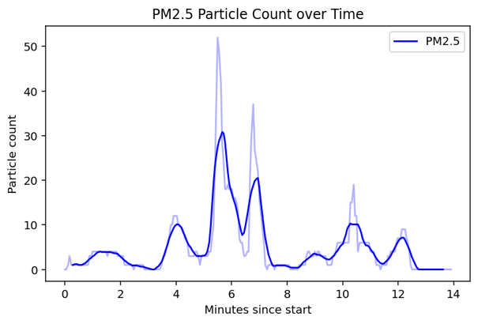

# AirBit-Research

Field study of PM2.5 and PM10 exposure along a pedestrian and cycle path next to the E6 highway in Alta, Norway, during winter late winter 2025 until 2026. Carried out in the upper secondary course *Teknologi og forskningslære* (Technology and Research Studies) using a low-cost sensor kit from UiT The Arctic University of Norway's [airbit](https://airbit.uit.no/) program.


## Research question

How high is the particulate matter concentration along the school route in winter, and is there a difference between walking on the side of the path closest to the road and the side furthest from it?

Two hypotheses were tested:

1. Concentrations would reach the "moderate" class in Norwegian air quality guidelines (PM10 above 60 µg/m³, PM2.5 above 30 µg/m³), since the route follows the E6 during morning rush hour.
2. Concentrations would be significantly higher on the side closest to the road.

## Method

- **Sensor:** airbit box logging PM2.5, PM10, temperature, humidity, GPS position and time every 3 seconds. Shorter intervals returned empty readings.
- **Setup:** box mounted on a backpack at about 125 cm above ground, walking the same planned route each time.
- **Period:** school days from 16 February to 24 March 2026, starting around 08:00, about 15 minutes per run.
- **Design:** 16 runs, 8 on the road side and 8 on the far side of the path. The two positions were about 2.5 to 3 m apart. Weather, wind and snow on the road were logged for each run.
- **Data cleaning:** one run (19 March) recorded no data and was discarded, leaving 7 near and 8 far runs. One run (23 February) showed unusually high values with no identifiable fault, so all analyses were done both with and without it.
- **Analysis:** per-run mean and sample standard deviation, one-tailed two-sample t-tests (near > far), and time-series plots. Each run was smoothed with a centered moving average (k = 5, about 33 seconds), interpolated onto a common time axis and averaged per group.

## Results

| | Mean concentration | Air quality class |
|---|---|---|
| PM10 | about 4.8 µg/m³ | Low (below 60) |
| PM2.5 | about 4.2 µg/m³ | Low (below 30) |

- Both hypotheses were rejected. Levels stayed well within the "low" class throughout the period.
- None of the four t-tests (PM2.5 and PM10, with and without 23 February) showed a significant difference between the two sides at the 5 % level. The averaged curves show a weak tendency toward higher values on the road side, but not a consistent one.
- The most likely explanation for the low levels is timing. The measurements were taken in midwinter with snow cover, outside the autumn and spring periods when studded tyres and tyre changes drive road dust to its peak.



## Limitations

- **Near and far were measured on different days** with a single sensor, so day-to-day variation in weather and traffic is mixed into the position effect. Alternating sides within the same walk would give a cleaner comparison.
- **Small sample** (7 vs 8 runs) gives low statistical power. The result is "no detected difference", not proof that no difference exists.
- **Temperature calibration is described but its result is not reported.** The PM sensor's accuracy depends on temperature, with the manufacturer giving a maximum error that varies between -10 °C and 60 °C. The box's temperature sensor was therefore checked against a PASCO reference sensor. This showed that it needed 10 to 15 minutes to stabilize, so the box was left outside before each run. However, the report does not state how closely the two sensors agreed after stabilizing, what temperatures were measured during the runs, or what maximum PM error this implies. The calibration was done, but it is never used to put an uncertainty on the results.
- **No reference comparison for PM.** The PM sensor itself was not compared against an official monitoring station, so absolute values depend on the factory calibration.
- **Time alignment:** the logged times at the E6 and the roundabout were meant to align runs to the same points on the route, but the plots are aligned by time since start.
- **Humidity** was logged but not used. High humidity can inflate readings from optical PM sensors.
- **Traffic volume** was not counted, even though traffic is the main expected source.
- **Averaging period:** the Norwegian air quality classes are defined for hourly means, while each run lasted about 15 minutes.
- **Mentioned wrong program type** In the report it is said that loess/lowess method is used to help understand the concentration however this is wrong. The program in here and used in the report is a moving/dynamic average

## My role

This was a two-person project with separate written reports. I was responsible for the field data collection and for all Python processing and visualization (smoothing, group averaging and time-series plots). The summary tables and t-tests were done in Excel by my project partner. For the actual build when we soldered and connected the pieces we
were just regularly switching.

## Repository contents

```
data/       Raw CSV files from the airbit box, one per run
Media/      Plots used in the report as well as pictures of measurement box
programs/   Smoothing, group averaging and plotting
report      Full report in Norwegian (PDF)
```

## Running the code

```
pip install numpy matplotlib
python analysis.py
```

## References (note these are directly from report and does not fix the loess citing mistake)

- Borge, I. C., Borgan, Ø., Engeseth, J., Heir, O., Moe, H., Norderhaug, T. T., & Vie, S. M. (2021). Anvendelser og modeller. In *Matematikk R1* (pp. 333-338). Aschehoug.
- Folkehelseinstituttet. (2025, January 24). *Svevestøv.* https://www.fhi.no/kl/luftforurensninger/luftkvalitet/temakapitler/svevestov/
- Kaur, S., Nieuwenhuijsen, M., & Colvile, R. (2005). *Pedestrian exposure to air pollution along a major road in Central London, UK.* https://hero.epa.gov/reference/88175/
- Miljødirektoratet. (2018). *Helseråd og forurensningsklasser.* https://luftkvalitet.miljodirektoratet.no/artikkel/artikler/helserad_og_forurensningsklasser/
- Miljødirektoratet. (n.d.). *Kilder til svevestøv.* Retrieved April 15, 2026, from https://luftkvalitet.miljodirektoratet.no/artikkel/artikler/kilder-til-luftforurensning/
- Sundvor, I. (2019, January 29). *Snøen går, svevestøvet kommer.* NILU. https://nilu.no/2016/03/snoen-gar-svevestovet-kommer/
- UiT. (n.d.). *Bygging.* airbit. Retrieved May 11, 2026, from https://airbit.uit.no/bygging/